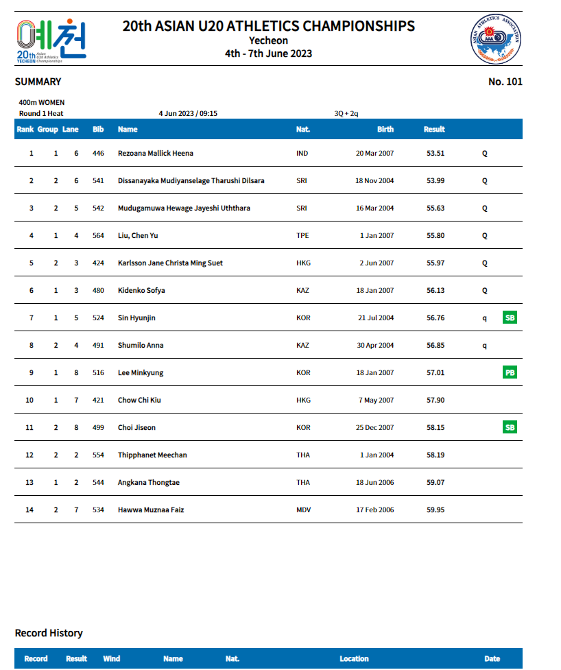
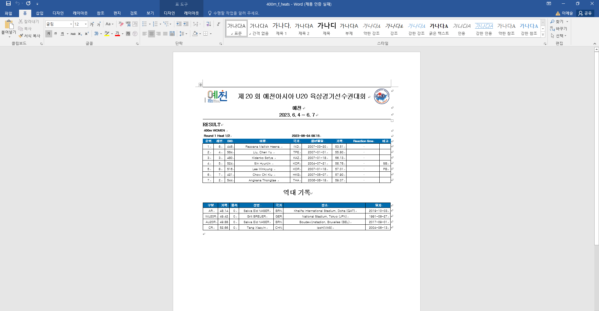

# 육상경기 프로젝트(u20.kr)

## 💡 프로젝트 소개

고객께서 원하시는 페이지 제작 의뢰를 토대로 제작하였습니다.

경기들의 점수는 스크립트로 점수를 매기도록 하였습니다

PDF word 생성

목록 페이지 생성

경기 규칙에 맞게 프로그램 제작

경기 규칙은 스크립트로 제작 되었습니다.

(해당 프로젝트)

#### 진행 기간(프론트)

(8개월 프로젝트에서 4월에 받아서 빠르게 제작 되었습니다.)

- 23.04.05 - 23.06.23

### 🧙 맴버구성

- 프론트 엔드 : 배정태 (웹 페이지 제작 및 반응형제작)

### ⚙️ 개발 환경

- `Visual Studio`

### 웹 페이지

메인페이지

경기 목록 페이지

경기 페이지

선수 목록 페이지

PDF

word

